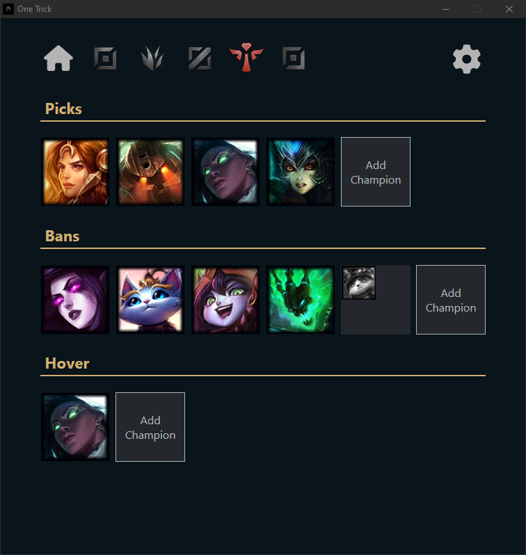
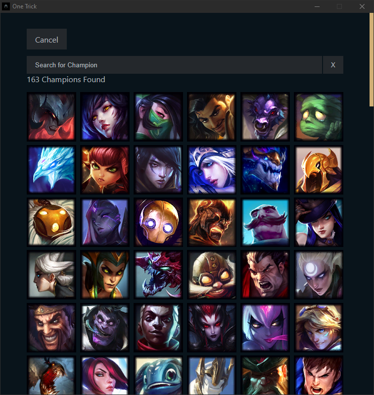
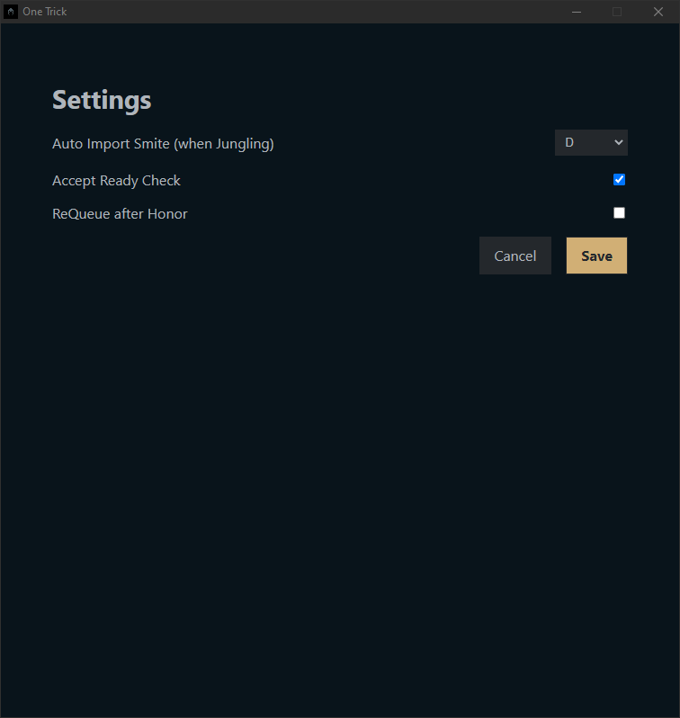
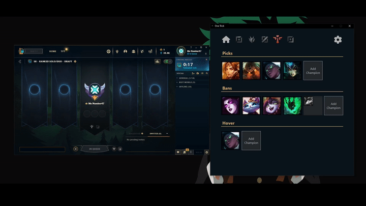
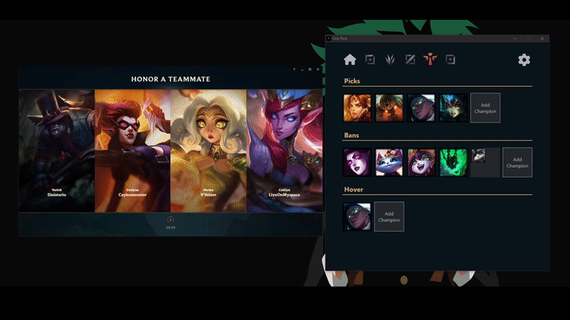

# Screenshots

<div style="display: flex; justify-content: space-between">
    
    
    
</div>

# Features

## Automatically accepts ready check



## Automatically Hovers, Bans, and Picks the first available champion


## Automatically Start matchmacking after honoring a teammate



# Development

[](https://github.com/davidc4747/one-trick) [](https://github.com/davidc4747/one-trick/pulls)

**Tools**: Riot lcu API, React, electron, Cypress, vite

Setup:

```shell
git clone https://github.com/davidc4747/one-trick
cd one-trick/
npm install
npm run start
```
